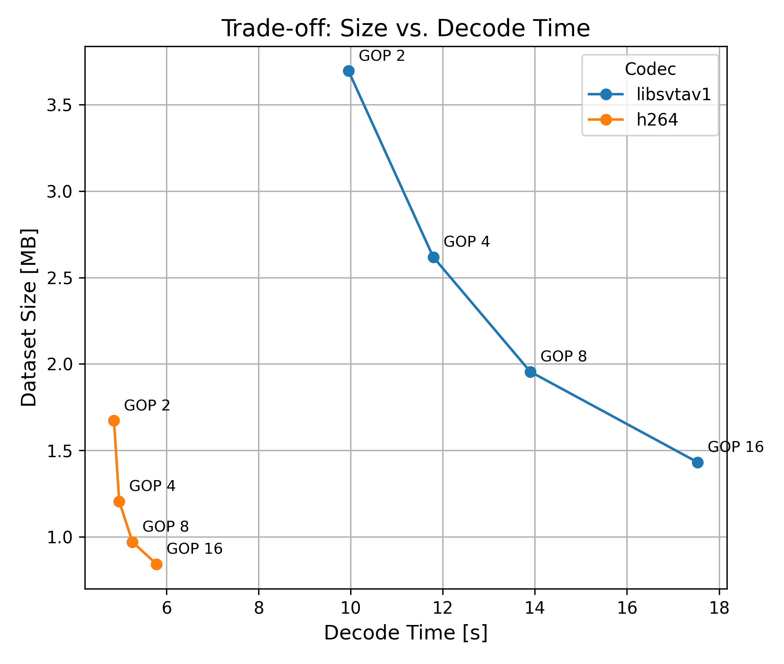

# lerobot PR Test Repository
see https://github.com/huggingface/lerobot/pull/1744

A small benchmark for `LeRobotDataset` video encoding/decoding performance using GIF input.  
Runs experiments with different codecs and GOP sizes, saves results, and plots size vs. decode time.  
Also includes a quick check for the old API.

## Installation
```bash
uv sync
```

## Usage
Check old api
```
uv run check_original_api.py  # no error
```

Run the benchmark
```
uv run main.py
uv run plot.py
```

The resulting size vs. decode time plot will be saved as `paleto-plot.png`.

